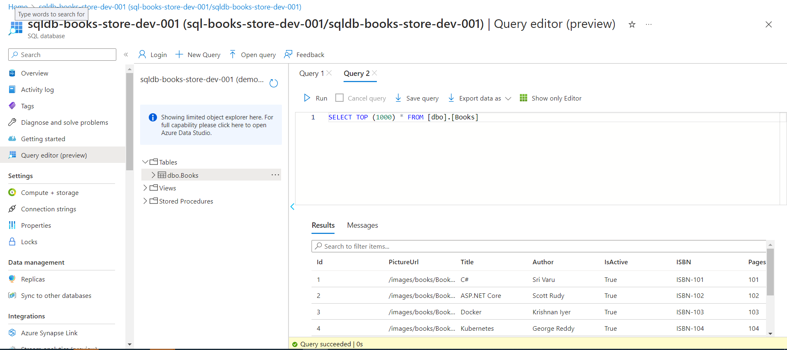

# Manoj Aitha - Sand Glass - JDBC with Sqlite Console Apps.

## Date Time: 26-Mar-2023 at 09:00 AM IST

## Java Training acquired
> 1. JAVA SWING: Subtle understanding of Swing components and functionalities and their role in creating customized and complex applications. Worked on basic applications such as Calculator, Basic sEmployee Management System etc., the inclusion of JDBC and OOPS concepts that makes it more custom-oriented and user interactive.
 
> 2. JAVA FX: Basic overview and brief understanding of JAVA FX and its use cases that can be implemented for creating applications. Worked on simple applications such as Calculator,Login Forms and To-do App where we can track attendance and add new employees and explored various components involved that make the portrayal of the application rich and interactive.
 
> 3. JAVA: Good understanding of OOPS concepts and JDBC.Currently, at a beginner’s level, but constantly working to build and sharpen my skills that can contribute to overall growth.

## Pull Request process, Continues Integration and Continues Delivery

**References:**
> 1. [https://learn.microsoft.com/en-us/azure/devops/repos/git/about-pull-requests?view=azure-devops](https://learn.microsoft.com/en-us/azure/devops/repos/git/about-pull-requests?view=azure-devops)
> 1. [https://learn.microsoft.com/en-us/azure/architecture/example-scenario/apps/devops-dotnet-baseline](https://learn.microsoft.com/en-us/azure/architecture/example-scenario/apps/devops-dotnet-baseline)

### CRUD Operations with JDBC and Azure SQL Server

> 1. We have created SQL Server and Database in Azure portal.
> 1. We have created a single table called `Books` and prepopulated with few rows 
> 1. We have installed SQL Server extension in VSCode.
> 1. We will be able to connect to SQl Server and its database which has hosted in `Azure`.

### SQl Server and Database in Azure portal

### Connecting to SQL Server and Database hosted in Azure using VSCode

## Insertion and Display Operations

> I have used 2 functions for Insertion where in Insert() is used to insert a single record and InsertMultiple() is used to insert multiple records according to the user convenience.

## Sand Glass Console App

> Sand-Glass Console App takes the input from the user and prints a Sand-Glass pattern.My business logic consists of 2 for loops where in the first for loop is to print the top Sand-Glass and the second for loop is to print the botton Sand-Glass.

## Installation

To use this Sand-Glass Console app, you can follow the steps below:

> 1. Clone the repository. You can also download the zip file and extract it to your preferred directory.

> 2. Open the project in your favorite Java IDE (e.g. Eclipse, IntelliJ IDEA, NetBeans). Ensure that you have installed the necessary dependencies required for the project to run.

> 3. Run the SandGlassDemo file. This should open the Sand-Glass app window. 

## Output

